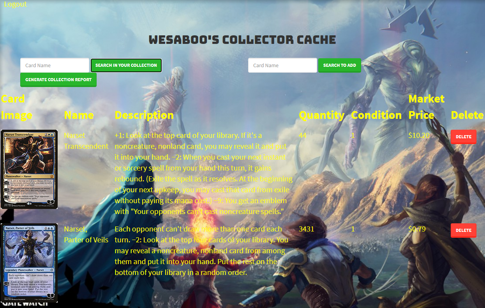
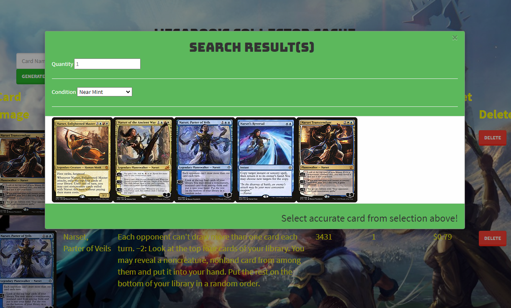

### Github Username: Lulamoon96, wesaboo, Esparza96, admishra93

## Project/Repo Title: Collectors Cache

## Deployed : https://immense-spire-70706.herokuapp.com/

Description: A database web app that keep tracks of your Magic the Gathering Card collection and provides accurate and updated Market Prices. Technologies utilized includes, mySQL database, PDF Gun API for exporting information to PDF, bcryptJS to encrypt password for login information. Backend technologies are express, handlebars, passport, and sequelize. Frontend libraries used includes bootstrap and jquery.

Installation Instructions: User must create an account, requirements are Username, Password, and Email address.

How to use: Once logged in, user can search for a card by name, once name is entered a modal will show up providing images of any cards that correlates to the entry. User can change the quantity and condition of the card before selecting the corresponding card image to add it to the user's database. User can also search through collection for specific cards using keywords.

License: ISC

Contributor: Luigi Galvan, Wesley Tran, Alexis E. Esparza, Avinash Mishra

